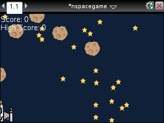
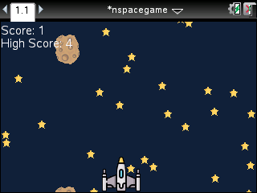
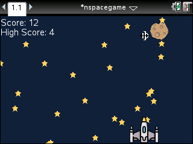

# N-SpaceGame
A sinple game for the TI-Nspire calculator written in lua.

# Screenshots

## Controls

| Key(s)                   | Action      |
|--------------------------|-------------|
| Moving Mouse cursor      | Move Player |

## How to play
Avoid the falling down astoroids.

## How to Install

### .tns file from releases page

Download the `.tns` file from the latest release
[here](https://github.com/BiberGames/N-SpaceGame/releases) and copy
it to your calculator with the original software or with [N-Link](https://github.com/lights0123/n-link).

## Building yourself
Yust type `make` in the terminal and have [Python 3](https://www.python.org/) with the [PIL Libary](https://pillow.readthedocs.io/en/stable/).

## Other Open source projects used
Packaging lua code for the calculator with [Luna](https://github.com/ndless-nspire/Luna).

Converting sprites with [TI Resource Merge](https://github.com/DaveDuck321/TI-Resource-Merge).
